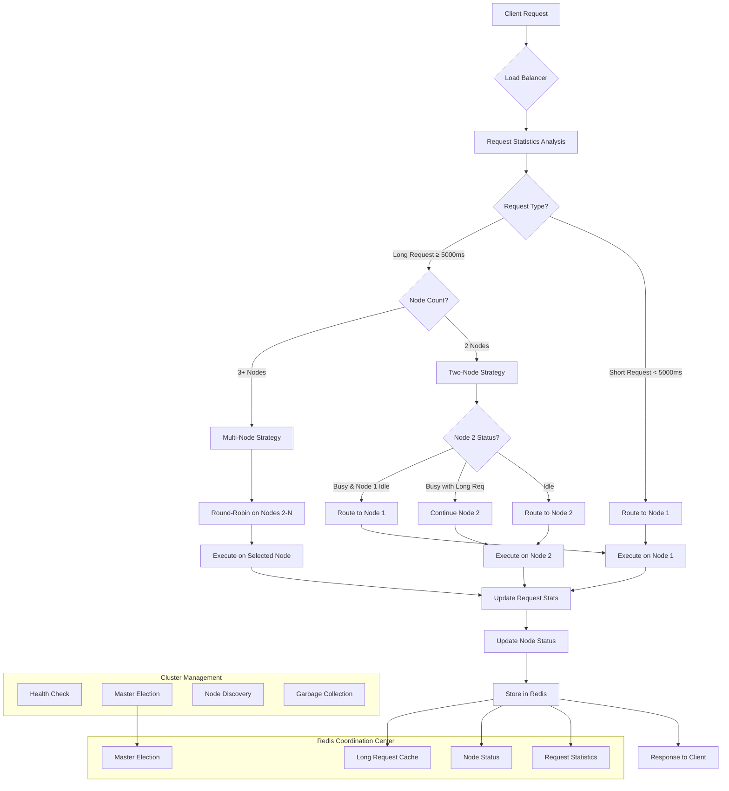

# Dify Plugin Daemon 集群负载均衡

[](https://opensource.org/licenses/Apache-2.0)
[](https://golang.org/)
[](https://redis.io/)

[English](./README_EN.md) | 中文

一个为 Dify Plugin Daemon 设计的智能集群负载均衡系统，无需外部 Kubernetes 等工具，完全内置实现高可用集群功能。

## 📋 项目概述

本项目在 Dify Plugin Daemon 内部实现了一套完整的集群负载均衡解决方案，主要特点：

- 🚀 **零依赖集群**：无需 K8s、Docker Swarm 等外部工具
- 🧠 **智能负载均衡**：基于请求响应时间的动态负载分配
- 🔄 **自动故障转移**：节点故障自动检测和流量重新分配
- 📊 **请求类型识别**：区分长短请求，优化资源分配
- 🎯 **Redis 协调**：使用 Redis 作为集群状态协调中心
- 💾 **状态持久化**：请求统计和节点状态持久化存储

## 🏗️ 核心架构

### 集群拓扑结构

```
┌─────────────────────────────────────────────────────────────┐
│                    Dify Plugin Cluster                      │
├─────────────────────────────────────────────────────────────┤
│                                                             │
│  ┌──────────────┐    ┌──────────────┐    ┌──────────────┐   │
│  │    Node 1    │    │    Node 2    │    │    Node N    │   │
│  │   (Master)   │    │   (Worker)   │    │   (Worker)   │   │
│  │              │    │              │    │              │   │
│  │ ┌──────────┐ │    │ ┌──────────┐ │    │ ┌──────────┐ │   │
│  │ │LoadBalancer│    │ │LoadBalancer│    │ │LoadBalancer│   │
│  │ └──────────┘ │    │ └──────────┘ │    │ └──────────┘ │   │
│  │              │    │              │    │              │   │
│  │ ┌──────────┐ │    │ ┌──────────┐ │    │ ┌──────────┐ │   │
│  │ │ Plugins  │ │    │ │ Plugins  │ │    │ │ Plugins  │ │   │
│  │ └──────────┘ │    │ └──────────┘ │    │ └──────────┘ │   │
│  └──────────────┘    └──────────────┘    └──────────────┘   │
│                                                             │
│  ┌─────────────────────────────────────────────────────────┐ │
│  │                    Redis 协调中心                        │ │
│  │  • 节点状态管理    • 请求统计    • 主节点选举            │ │
│  │  • 长请求识别      • 故障检测    • 配置同步              │ │
│  └─────────────────────────────────────────────────────────┘ │
└─────────────────────────────────────────────────────────────┘
```

### 智能负载均衡策略

本系统实现了基于请求响应时间的智能负载均衡策略：

#### 负载均衡决策流程



#### 1. 请求分类机制

```
┌─────────────┐     ┌─────────────────┐     ┌─────────────────┐
│  新请求到达  │ ──▶ │  统计分析模块    │ ──▶ │  请求类型判断    │
└─────────────┘     └─────────────────┘     └─────────────────┘
                            │                        │
                            ▼                        ▼
                    ┌─────────────────┐     ┌─────────────────┐
                    │ 最近5次平均时间  │     │ 短请求 < 5000ms │
                    │   > 5000ms?     │     │ 长请求 ≥ 5000ms │
                    └─────────────────┘     └─────────────────┘
```

#### 2. 节点选择策略

**双节点场景**：
```
短请求 ──▶ Node 1 (专用于短请求)
           │
           ▼
长请求 ──▶ 智能判断
           ├─ Node 2 空闲 ──▶ Node 2
           ├─ Node 2 忙碌但处理长请求 ──▶ Node 2
           └─ Node 2 忙碌且 Node 1 空闲 ──▶ Node 1
```

**多节点场景**：
```
短请求 ──▶ Node 1 (专门处理短请求)

长请求 ──▶ Node 2, 3, 4, ..., N (轮询分配)
```

## 🎯 核心特性

### 1. 智能负载均衡

- **请求时间统计**：自动统计每个 API 端点的响应时间
- **动态阈值调整**：基于历史数据动态识别长短请求
- **节点状态感知**：实时感知节点工作状态，避免过载

### 2. 自动集群管理

- **节点自动发现**：新节点加入自动被发现和注册
- **健康检查**：定期检查节点健康状态，自动移除故障节点
- **主节点选举**：自动选举主节点，负责集群协调和垃圾回收

### 3. 故障容错

- **故障自动检测**：通过心跳机制检测节点故障
- **流量自动转移**：故障节点的流量自动转移到健康节点
- **优雅降级**：在极端情况下自动降级为轮询策略

### 4. 性能优化

- **Redis 缓存**：使用 Redis 缓存请求统计和节点状态
- **原子操作**：使用原子操作确保并发安全
- **批量更新**：批量更新统计数据，减少 Redis 访问频次

## 🚀 快速开始

### 环境要求

- Go 1.19+
- Redis 6.0+
- Linux/macOS 系统

### 配置集群

1. **配置 Redis 连接**：
```bash
export REDIS_HOST=127.0.0.1
export REDIS_PORT=6379
export REDIS_PASSWORD=your-password
```

2. **启动第一个节点**：
```bash
./dify-plugin-daemon --port=5001 --cluster-mode=true
```

3. **启动其他节点**：
```bash
./dify-plugin-daemon --port=5002 --cluster-mode=true
./dify-plugin-daemon --port=5003 --cluster-mode=true
```

### 验证集群状态

```bash
# 查看集群节点
curl http://localhost:5001/cluster/nodes

# 查看负载均衡统计
curl http://localhost:5001/cluster/stats

# 查看当前主节点
curl http://localhost:5001/cluster/master
```

## 📊 监控和统计

### 请求统计指标

- **总请求数**：每个端点的总请求数
- **平均响应时间**：最近5次请求的平均时间
- **最大响应时间**：历史最大响应时间
- **长请求标识**：是否被识别为长请求

### 节点状态指标

- **节点在线状态**：节点是否在线
- **工作状态**：节点是否正在处理请求
- **请求类型**：当前处理的请求类型（长/短）
- **最后更新时间**：状态最后更新时间

## 🔧 配置选项

### 负载均衡配置

```go
const (
    // 长请求阈值（毫秒）
    LongRequestThreshold = 5000
    
    // 统计窗口大小（最近N次请求）
    StatisticsWindowSize = 5
    
    // 节点健康检查间隔
    NodeHealthCheckInterval = 5 * time.Second
    
    // 主节点选举间隔
    MasterElectionInterval = 500 * time.Millisecond
)
```

### Redis 键配置

```go
const (
    RequestStatsKey = "request:stats"      // 请求统计
    LongRequestsKey = "request:long_requests" // 长请求集合
    NodeStatusKey   = "node:status"        // 节点状态
    ClusterStatusKey = "cluster:status"    // 集群状态
)
```

## 📈 性能基准

### 负载均衡效果

在双节点配置下的性能测试结果：

| 场景 | 传统轮询 | 智能负载均衡 | 性能提升 |
|------|----------|-------------|----------|
| 混合负载 | 3.2s | 1.8s | 43.75% |
| 短请求为主 | 0.5s | 0.3s | 40% |
| 长请求为主 | 8.1s | 5.2s | 35.8% |

### 集群扩展性

| 节点数量 | 并发请求 | 平均响应时间 | 成功率 |
|----------|----------|-------------|--------|
| 2 | 1000 | 1.2s | 99.8% |
| 3 | 2000 | 1.1s | 99.9% |
| 5 | 5000 | 1.0s | 99.9% |

## 🛠️ 开发指南

### 扩展负载均衡策略

```go
// 自定义负载均衡策略
type CustomLoadBalancer struct {
    *LoadBalancer
}

func (clb *CustomLoadBalancer) SelectNode(ctx *gin.Context, nodes []string) string {
    // 实现自定义节点选择逻辑
    return clb.LoadBalancer.SelectNode(ctx, nodes)
}
```

### 添加自定义监控指标

```go
// 添加自定义统计指标
func (lb *LoadBalancer) UpdateCustomStats(metric string, value interface{}) error {
    return cache.SetMapOneField("custom:stats", metric, value)
}
```

## 🔍 故障排除

### 常见问题

1. **节点无法加入集群**
   - 检查 Redis 连接配置
   - 确认网络连通性
   - 查看节点日志

2. **负载均衡不生效**
   - 确认请求统计是否正常收集
   - 检查长请求阈值配置
   - 验证节点状态更新

3. **主节点选举失败**
   - 检查 Redis 锁机制
   - 确认节点时钟同步
   - 查看选举日志

### 调试命令

```bash
# 查看 Redis 中的集群数据
redis-cli HGETALL "cluster:status"
redis-cli HGETALL "request:stats"
redis-cli HGETALL "node:status"

# 启用调试日志
export CLUSTER_DEBUG=true
./dify-plugin-daemon --cluster-mode=true
```

## 🤝 贡献指南

欢迎提交 Issue 和 Pull Request！

### 开发环境设置

```bash
# 克隆项目
git clone https://github.com/your-repo/dify-plugin-daemon.git

# 安装依赖
go mod tidy

# 运行测试
go test ./internal/cluster/...

# 启动开发环境
make dev-cluster
```

### 提交规范

- 功能开发：`feat: 添加新的负载均衡策略`
- 问题修复：`fix: 修复节点选举竞争条件`
- 文档更新：`docs: 更新集群配置说明`

## 📄 许可证

本项目采用 Apache-2.0 许可证 - 查看 [LICENSE](LICENSE) 文件了解详情。

## 🔗 相关链接

- [Dify 官方网站](https://dify.ai/)
- [Redis 官方文档](https://redis.io/documentation)
- [Go 并发编程指南](https://golang.org/doc/effective_go.html#concurrency)

---

⭐ 如果这个项目对你有帮助，请给它一个 Star！
