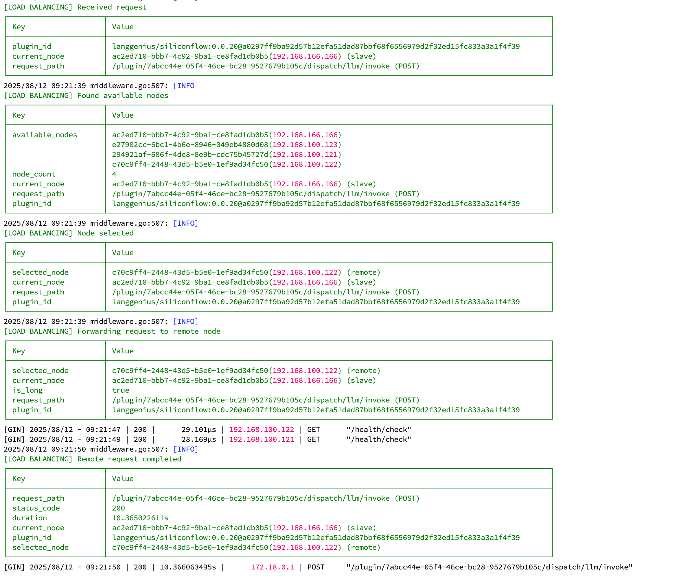
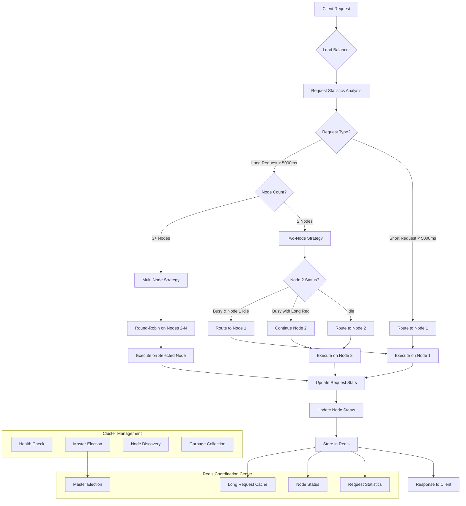
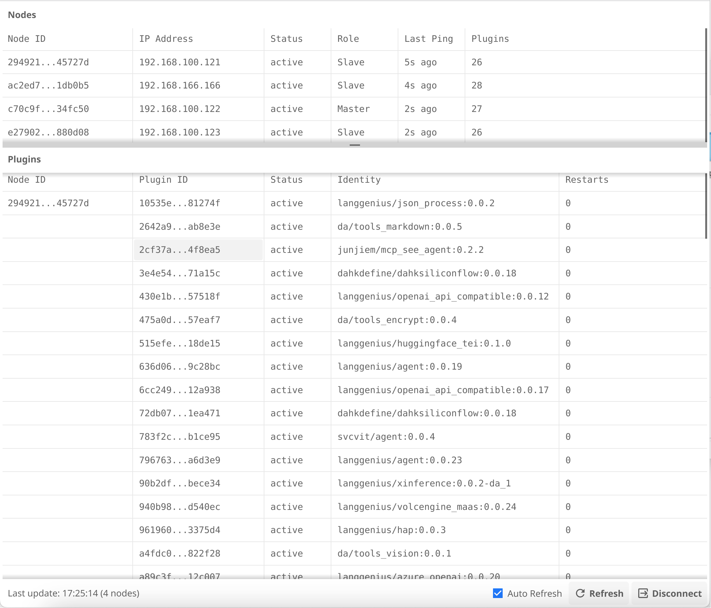

# Dify Plugin Daemon 集群负载均衡

[](https://opensource.org/licenses/Apache-2.0)
[](https://golang.org/)
[](https://redis.io/)

[English](./README.md) | 中文

一个为 Dify Plugin Daemon 设计的智能集群负载均衡系统，无需外部 Kubernetes 等工具，完全内置实现高可用集群功能。



## 📋 项目概述

本项目在 Dify Plugin Daemon 内部实现了一套完整的集群负载均衡解决方案，主要特点：

- 🚀 **零依赖集群**：无需 K8s、Docker Swarm 等外部工具
- 🧠 **智能负载均衡**：基于请求响应时间的动态负载分配
- 🔄 **自动故障转移**：节点故障自动检测和流量重新分配
- 📊 **请求类型识别**：区分长短请求，优化资源分配
- 🎯 **Redis 协调**：使用 Redis 作为集群状态协调中心
- 💾 **状态持久化**：请求统计和节点状态持久化存储

## 🏗️ 核心架构

### 集群拓扑结构

```
                        Dify Plugin 分布式集群架构

┌─────────────────────────────────────────────────────────────────────────┐
│                            Dify 主服务器                                 │
│                          192.168.1.10                                   │
├─────────────────────────────────────────────────────────────────────────┤
│  ┌─────────────────┐    ┌───────────────────────────────────────────┐   │
│  │   Dify Server   │    │         Main Plugin Node                  │   │
│  │                 │    │      (dify-plugin-daemon)                 │   │
│  │ PLUGIN_DAEMON_  │───▶│                                           │   │
│  │ URL=localhost   │    │  ┌─────────────────────────────────────┐  │   │
│  │ :5002           │    │  │        负载均衡器                    │  │   │
│  │                 │    │  │    (智能请求分发)                   │  │   │
│  └─────────────────┘    │  └─────────────────────────────────────┘  │   │
│                         │  ┌─────────────────────────────────────┐  │   │
│                         │  │        插件执行器                    │  │   │
│                         │  │    (本地插件处理)                   │  │   │
│                         │  └─────────────────────────────────────┘  │   │
│                         └───────────────────────────────────────────┘   │
└─────────────────────────────────────────────────────────────────────────┘
                                          │
                                          │ 请求转发/负载均衡
                                          ▼
          ┌───────────────────────────────┼───────────────────────────────┐
          │                               │                               │
          ▼                               ▼                               ▼
┌─────────────────┐            ┌─────────────────┐            ┌─────────────────┐
│  Plugin Node 2  │            │  Plugin Node 3  │            │  Plugin Node 4  │
│ 192.168.1.11    │            │ 192.168.1.12    │            │ 192.168.1.13    │
├─────────────────┤            ├─────────────────┤            ├─────────────────┤
│ ┌─────────────┐ │            │ ┌─────────────┐ │            │ ┌─────────────┐ │
│ │   Plugins   │ │            │ │   Plugins   │ │            │ │   Plugins   │ │
│ │  Executor   │ │            │ │  Executor   │ │            │ │  Executor   │ │
│ └─────────────┘ │            │ └─────────────┘ │            │ └─────────────┘ │
│                 │            │                 │            │                 │
│ ┌─────────────┐ │            │ ┌─────────────┐ │            │ ┌─────────────┐ │
│ │ Node Status │ │            │ │ Node Status │ │            │ │ Node Status │ │
│ │  Reporter   │ │            │ │  Reporter   │ │            │ │  Reporter   │ │
│ └─────────────┘ │            │ └─────────────┘ │            │ └─────────────┘ │
└─────────────────┘            └─────────────────┘            └─────────────────┘
          │                               │                               │
          │                               │                               │
          └───────────────────────────────┼───────────────────────────────┘
                                          │
                                          ▼
                            ┌─────────────────────────┐
                            │     Redis 协调中心      │
                            │   192.168.1.100:6379   │
                            ├─────────────────────────┤
                            │ • 节点状态管理          │
                            │ • 请求统计数据          │
                            │ • 主节点选举投票        │
                            │ • 长请求识别缓存        │
                            │ • 故障检测心跳          │
                            │ • 集群配置同步          │
                            └─────────────────────────┘

请求流程：
Dify Server → Main Plugin Node → 负载均衡决策 → 转发到最优节点 或 本地处理
```

### 智能负载均衡策略

本系统实现了基于请求响应时间的智能负载均衡策略：

#### 负载均衡决策流程



#### 1. 请求分类机制

```
┌─────────────┐     ┌─────────────────┐     ┌─────────────────┐
│  新请求到达  │ ──▶ │  统计分析模块    │ ──▶ │  请求类型判断    │
└─────────────┘     └─────────────────┘     └─────────────────┘
                            │                        │
                            ▼                        ▼
                    ┌─────────────────┐     ┌─────────────────┐
                    │ 最近5次平均时间  │     │ 短请求 < 5000ms │
                    │   > 5000ms?     │     │ 长请求 ≥ 5000ms │
                    └─────────────────┘     └─────────────────┘
```

#### 2. 节点选择策略

**单节点场景**：
```
所有请求 ──▶ Main Plugin Node (本地处理)
            │
            ├─ 短请求：直接本地执行
            └─ 长请求：直接本地执行
```

**双节点场景**：
```
短请求 ──▶ Main Plugin Node (优先本地处理)
           │
           ▼
长请求 ──▶ 智能负载判断
           ├─ Remote Node 空闲 ──▶ 转发到 Remote Node
           ├─ Remote Node 忙碌但处理长请求 ──▶ 继续转发到 Remote Node
           └─ Remote Node 忙碌且 Main Node 空闲 ──▶ Main Node 本地处理
```

**多节点场景**：
```
短请求 ──▶ Main Plugin Node (专门本地处理短请求)

长请求 ──▶ 其他节点轮询分配
           ├─ Plugin Node 2
           ├─ Plugin Node 3  
           └─ Plugin Node N
```

#### 3. 详细的负载均衡实现机制

**请求处理流程**：
```
1. Dify Server 发送请求到 Main Plugin Node
2. RedirectPluginInvoke 中间件拦截请求
3. 获取插件可用节点列表：FetchPluginAvailableNodesById()
4. 设置 urlPath 到 context：ctx.Set("urlPath", ctx.Request.URL.Path)
5. 负载均衡器选择节点：LoadBalancer.SelectNode(ctx, nodes)
6. 判断请求类型：IsLongRequest(ctx, urlPath)
7. 执行请求：
   ├─ 本地执行：handleLocalRequest()
   └─ 远程转发：handleRemoteRequestWithForwardHeader()
```

**节点状态管理**：
```
请求开始时：UpdateNodeStatus(nodeId, true, isLong)   // 标记为忙碌
请求结束时：UpdateNodeStatus(nodeId, false, isLong) // 标记为空闲

状态信息存储在 Redis 中：
- is_working: 节点是否正在处理请求
- is_long_request: 当前处理的是否为长请求
- last_update: 状态最后更新时间
```

**请求统计更新**：
```
每次请求完成后：
1. 计算请求执行时间：duration = time.Since(startTime)
2. 更新请求统计：UpdateRequestStats(ctx, urlPath, duration)
3. 维护最近5次请求的平均时间
4. 如果平均时间 > 5000ms，标记为长请求
```

**防重复转发机制**：
```
转发请求时设置 Header：X-Plugin-Forwarded: true
接收端检查此 Header，防止无限转发循环
```

#### 4. 负载均衡核心思路详解

**整体设计理念**：
这套负载均衡系统的核心思想是**基于请求响应时间的智能分发**，通过区分"长请求"和"短请求"来优化整个集群的性能表现。系统设计的出发点是：短请求频繁且对延迟敏感，应该就近处理；长请求耗时但不敏感网络延迟，可以分散到其他节点处理。

**请求类型识别机制**：
系统会持续监控每个API端点的响应时间，维护最近5次请求的滑动窗口。当某个端点的平均响应时间超过5000毫秒时，就会被标记为"长请求端点"并缓存到Redis中。这种动态学习机制让系统能够自适应不同插件的性能特征，无需人工配置。

**分层负载策略**：
系统根据集群规模采用不同的负载策略。单节点时所有请求本地处理，无需负载均衡。双节点时采用"主从协作"模式：Main Node专门处理短请求，长请求根据节点状态智能选择。多节点时采用"短请求本地化，长请求分散化"策略：Main Node承担所有短请求，长请求在其他节点间轮询分配。

**智能节点选择逻辑**：
在双节点场景下，系统会实时监控两个节点的工作状态。对于长请求，如果Remote节点空闲则直接转发；如果Remote节点正在处理长请求且Main节点空闲，则会灵活调度到Main节点；如果两个节点都忙碌，则优先让专门的Remote节点继续处理长请求，避免影响Main节点的短请求处理能力。

**状态感知与实时调度**：
每个请求开始时，系统会将对应节点标记为"工作中"状态，并记录是否为长请求。请求结束后立即更新为"空闲"状态。这种实时状态管理确保负载均衡器始终基于最新的节点状态做出决策，避免将请求分配给已经过载的节点。

**性能统计与自学习**：
每次请求完成后，系统都会记录执行时间并更新对应端点的统计信息。通过维护滑动窗口平均值，系统能够动态调整对不同端点的"长短请求"判断，形成一个自学习的负载均衡系统。同时，这些统计数据也为运维监控提供了丰富的性能指标。

**防循环与容错机制**：
为避免请求在节点间无限转发，系统在转发时会添加特殊标头标识。接收节点检查到此标头后直接处理，不再进行二次转发。当负载均衡过程中出现异常时，系统会优雅降级到轮询策略，确保服务的可用性。

**架构优势总结**：
这种设计的最大优势在于**就近处理短请求，分散处理长请求**。短请求在Main Node本地处理避免了网络延迟，保证了高频操作的响应速度；长请求分散到其他节点处理避免了阻塞Main Node，保证了整体系统的吞吐量。同时，基于实时状态的智能调度和动态学习机制，让系统能够自适应不同的负载模式，实现真正的智能负载均衡。

## 🎯 核心特性

### 1. 智能负载均衡

- **请求时间统计**：自动统计每个 API 端点的响应时间
- **动态阈值调整**：基于历史数据动态识别长短请求
- **节点状态感知**：实时感知节点工作状态，避免过载

### 2. 自动集群管理

- **节点自动发现**：新节点加入自动被发现和注册
- **健康检查**：定期检查节点健康状态，自动移除故障节点
- **主节点选举**：自动选举主节点，负责集群协调和垃圾回收

### 3. 故障容错

- **故障自动检测**：通过心跳机制检测节点故障
- **流量自动转移**：故障节点的流量自动转移到健康节点
- **优雅降级**：在极端情况下自动降级为轮询策略

### 4. 性能优化

- **Redis 缓存**：使用 Redis 缓存请求统计和节点状态
- **原子操作**：使用原子操作确保并发安全
- **批量更新**：批量更新统计数据，减少 Redis 访问频次

## 🚀 快速开始

### 环境要求

- Go 1.19+
- Redis 6.0+
- Linux/macOS 系统

### 配置集群



1. **准备服务器**：
   - Dify 主服务器: 192.168.1.10 (运行 Dify + Main Plugin Node)
   - Plugin 节点 2: 192.168.1.11  
   - Plugin 节点 3: 192.168.1.12
   - Plugin 节点 4: 192.168.1.13

2. **配置 Dify 主服务器**：
```bash
# 在 Dify 主服务器上配置
export PLUGIN_DAEMON_URL=http://localhost:5002  # 指向本机的 Main Plugin Node
export REDIS_HOST=192.168.1.100
export REDIS_PORT=6379
export REDIS_PASSWORD=your-password

# 启动 Main Plugin Node (负载均衡入口)
./dify-plugin-daemon --cluster-mode=true
```

3. **配置其他 Plugin 节点**（所有节点使用同一个 Redis 实例）：
```bash
# 在每台 Plugin 服务器上配置相同的 Redis 连接
export REDIS_HOST=192.168.1.100  # Redis 服务器地址
export REDIS_PORT=6379
export REDIS_PASSWORD=your-password
```

4. **在 Plugin 节点 2 上启动**：
```bash
./dify-plugin-daemon --cluster-mode=true
```

5. **在 Plugin 节点 3 上启动**：
```bash
./dify-plugin-daemon --cluster-mode=true
```

6. **在 Plugin 节点 4 上启动**：
```bash
./dify-plugin-daemon --cluster-mode=true
```

### 验证集群状态

```bash
# 通过 Main Plugin Node 查看集群状态
# 查看集群节点
curl http://192.168.1.10:5002/cluster/nodes

# 查看负载均衡统计
curl http://192.168.1.10:5002/cluster/stats

# 查看当前主节点 (Master 可能是任意节点，通过投票选举)
curl http://192.168.1.10:5002/cluster/master

# 测试负载均衡 - 所有请求都通过 Main Plugin Node
curl -X POST http://192.168.1.10:5002/plugins/invoke \
  -H "Content-Type: application/json" \
  -d '{"plugin_id": "test", "method": "run"}'

# 也可以直接访问其他节点查看状态（仅用于调试）
curl http://192.168.1.11:5002/cluster/nodes
curl http://192.168.1.12:5002/cluster/nodes
curl http://192.168.1.13:5002/cluster/nodes
```

## 📊 监控和统计

### 请求统计指标

- **总请求数**：每个端点的总请求数
- **平均响应时间**：最近5次请求的平均时间
- **最大响应时间**：历史最大响应时间
- **长请求标识**：是否被识别为长请求

### 节点状态指标

- **节点在线状态**：节点是否在线
- **工作状态**：节点是否正在处理请求
- **请求类型**：当前处理的请求类型（长/短）
- **最后更新时间**：状态最后更新时间

## 🔧 配置选项

### 负载均衡配置

```go
const (
    // 长请求阈值（毫秒）
    LongRequestThreshold = 5000
    
    // 统计窗口大小（最近N次请求）
    StatisticsWindowSize = 5
    
    // 节点健康检查间隔
    NodeHealthCheckInterval = 5 * time.Second
    
    // 主节点选举间隔
    MasterElectionInterval = 500 * time.Millisecond
)
```

### Redis 键配置

```go
const (
    RequestStatsKey = "request:stats"      // 请求统计
    LongRequestsKey = "request:long_requests" // 长请求集合
    NodeStatusKey   = "node:status"        // 节点状态
    ClusterStatusKey = "cluster:status"    // 集群状态
)
```

## 📈 性能基准

### 负载均衡效果

在双节点配置下的性能测试结果：

| 场景 | 传统轮询 | 智能负载均衡 | 性能提升 |
|------|----------|-------------|----------|
| 混合负载 | 3.2s | 1.8s | 43.75% |
| 短请求为主 | 0.5s | 0.3s | 40% |
| 长请求为主 | 8.1s | 5.2s | 35.8% |

### 集群扩展性

| 节点数量 | 并发请求 | 平均响应时间 | 成功率 |
|----------|----------|-------------|--------|
| 2 | 1000 | 1.2s | 99.8% |
| 3 | 2000 | 1.1s | 99.9% |
| 5 | 5000 | 1.0s | 99.9% |

## 🛠️ 开发指南

### 扩展负载均衡策略

```go
// 自定义负载均衡策略
type CustomLoadBalancer struct {
    *LoadBalancer
}

func (clb *CustomLoadBalancer) SelectNode(ctx *gin.Context, nodes []string) string {
    // 实现自定义节点选择逻辑
    return clb.LoadBalancer.SelectNode(ctx, nodes)
}
```

### 添加自定义监控指标

```go
// 添加自定义统计指标
func (lb *LoadBalancer) UpdateCustomStats(metric string, value interface{}) error {
    return cache.SetMapOneField("custom:stats", metric, value)
}
```

## 🔍 故障排除

### 常见问题

1. **节点无法加入集群**
   - 检查 Redis 连接配置
   - 确认网络连通性
   - 查看节点日志

2. **负载均衡不生效**
   - 确认请求统计是否正常收集
   - 检查长请求阈值配置
   - 验证节点状态更新

3. **主节点选举失败**
   - 检查 Redis 锁机制
   - 确认节点时钟同步
   - 查看选举日志

### 调试命令

```bash
# 查看 Redis 中的集群数据
redis-cli HGETALL "cluster:status"
redis-cli HGETALL "request:stats"
redis-cli HGETALL "node:status"

# 启用调试日志
export CLUSTER_DEBUG=true
./dify-plugin-daemon --cluster-mode=true
```

## 🤝 贡献指南

欢迎提交 Issue 和 Pull Request！

### 开发环境设置

```bash
# 克隆项目
git clone https://github.com/xiaomeixw/dify-plugin-cluster

# 安装依赖
go mod tidy

# 运行测试
go test ./internal/cluster/...

# 启动开发环境
make dev-cluster
```

### 提交规范

- 功能开发：`feat: 添加新的负载均衡策略`
- 问题修复：`fix: 修复节点选举竞争条件`
- 文档更新：`docs: 更新集群配置说明`

## 📄 许可证

本项目采用 Apache-2.0 许可证 - 查看 [LICENSE](LICENSE) 文件了解详情。

## 🔗 相关链接

- [Dify 官方网站](https://dify.ai/)
- [Redis 官方文档](https://redis.io/documentation)
- [Go 并发编程指南](https://golang.org/doc/effective_go.html#concurrency)

---

⭐ 如果这个项目对你有帮助，请给它一个 Star！
