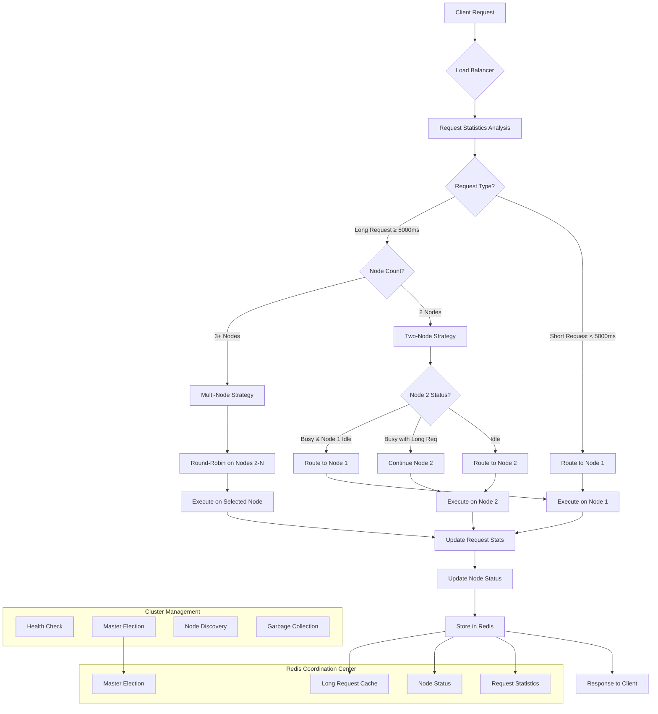

# Dify Plugin Daemon Cluster Load Balancer

[](https://opensource.org/licenses/Apache-2.0)
[](https://golang.org/)
[](https://redis.io/)

English | [中文](./README.md)

An intelligent cluster load balancing system designed for Dify Plugin Daemon, with no external dependencies like Kubernetes, implementing high-availability cluster functionality entirely built-in.

## 📋 Project Overview

This project implements a complete cluster load balancing solution within Dify Plugin Daemon, featuring:

- 🚀 **Zero-Dependency Cluster**: No need for K8s, Docker Swarm or other external tools
- 🧠 **Intelligent Load Balancing**: Dynamic load distribution based on request response time
- 🔄 **Automatic Failover**: Automatic node failure detection and traffic redistribution
- 📊 **Request Type Recognition**: Distinguish between long and short requests for optimized resource allocation
- 🎯 **Redis Coordination**: Using Redis as cluster state coordination center
- 💾 **State Persistence**: Persistent storage of request statistics and node states

## 🏗️ Core Architecture

### Cluster Topology

```
┌─────────────────────────────────────────────────────────────┐
│                    Dify Plugin Cluster                      │
├─────────────────────────────────────────────────────────────┤
│                                                             │
│  ┌──────────────┐    ┌──────────────┐    ┌──────────────┐   │
│  │    Node 1    │    │    Node 2    │    │    Node N    │   │
│  │   (Master)   │    │   (Worker)   │    │   (Worker)   │   │
│  │              │    │              │    │              │   │
│  │ ┌──────────┐ │    │ ┌──────────┐ │    │ ┌──────────┐ │   │
│  │ │LoadBalancer│    │ │LoadBalancer│    │ │LoadBalancer│   │
│  │ └──────────┘ │    │ └──────────┘ │    │ └──────────┘ │   │
│  │              │    │              │    │              │   │
│  │ ┌──────────┐ │    │ ┌──────────┐ │    │ ┌──────────┐ │   │
│  │ │ Plugins  │ │    │ │ Plugins  │ │    │ │ Plugins  │ │   │
│  │ └──────────┘ │    │ └──────────┘ │    │ └──────────┘ │   │
│  └──────────────┘    └──────────────┘    └──────────────┘   │
│                                                             │
│  ┌─────────────────────────────────────────────────────────┐ │
│  │                  Redis Coordination Center               │ │
│  │  • Node Management  • Request Stats  • Master Election │ │
│  │  • Long Req Detection • Health Check • Config Sync     │ │
│  └─────────────────────────────────────────────────────────┘ │
└─────────────────────────────────────────────────────────────┘
```

### Intelligent Load Balancing Strategy

This system implements an intelligent load balancing strategy based on request response time:

#### Load Balancing Decision Flow



#### 1. Request Classification Mechanism

```
┌─────────────┐     ┌─────────────────┐     ┌─────────────────┐
│ New Request │ ──▶ │ Statistics      │ ──▶ │ Request Type    │
│   Arrives   │     │ Analysis Module │     │  Classification │
└─────────────┘     └─────────────────┘     └─────────────────┘
                            │                        │
                            ▼                        ▼
                    ┌─────────────────┐     ┌─────────────────┐
                    │ Recent 5 Avg    │     │ Short < 5000ms  │
                    │ Time > 5000ms?  │     │ Long ≥ 5000ms   │
                    └─────────────────┘     └─────────────────┘
```

#### 2. Node Selection Strategy

**Two-Node Scenario**:
```
Short Requests ──▶ Node 1 (Dedicated for short requests)
                   │
                   ▼
Long Requests ──▶ Smart Decision
                   ├─ Node 2 Idle ──▶ Node 2
                   ├─ Node 2 Busy with Long Req ──▶ Node 2
                   └─ Node 2 Busy & Node 1 Idle ──▶ Node 1
```

**Multi-Node Scenario**:
```
Short Requests ──▶ Node 1 (Dedicated for short requests)

Long Requests ──▶ Node 2, 3, 4, ..., N (Round-robin distribution)
```

## 🎯 Core Features

### 1. Intelligent Load Balancing

- **Request Time Statistics**: Automatically collect response time for each API endpoint
- **Dynamic Threshold Adjustment**: Dynamically identify long/short requests based on historical data
- **Node State Awareness**: Real-time awareness of node working status to avoid overload

### 2. Automatic Cluster Management

- **Node Auto-Discovery**: New nodes are automatically discovered and registered
- **Health Checks**: Regular health checks, automatically remove failed nodes
- **Master Election**: Automatic master node election for cluster coordination and garbage collection

### 3. Fault Tolerance

- **Automatic Failure Detection**: Detect node failures through heartbeat mechanism
- **Automatic Traffic Transfer**: Traffic from failed nodes automatically transferred to healthy nodes
- **Graceful Degradation**: Automatically degrade to round-robin strategy in extreme cases

### 4. Performance Optimization

- **Redis Caching**: Use Redis to cache request statistics and node states
- **Atomic Operations**: Use atomic operations to ensure concurrency safety
- **Batch Updates**: Batch update statistical data to reduce Redis access frequency

## 🚀 Quick Start

### Requirements

- Go 1.19+
- Redis 6.0+
- Linux/macOS systems

### Cluster Configuration

1. **Configure Redis Connection**:
```bash
export REDIS_HOST=127.0.0.1
export REDIS_PORT=6379
export REDIS_PASSWORD=your-password
```

2. **Start First Node**:
```bash
./dify-plugin-daemon --port=5001 --cluster-mode=true
```

3. **Start Other Nodes**:
```bash
./dify-plugin-daemon --port=5002 --cluster-mode=true
./dify-plugin-daemon --port=5003 --cluster-mode=true
```

### Verify Cluster Status

```bash
# View cluster nodes
curl http://localhost:5001/cluster/nodes

# View load balancing statistics
curl http://localhost:5001/cluster/stats

# View current master node
curl http://localhost:5001/cluster/master
```

## 📊 Monitoring and Statistics

### Request Statistics Metrics

- **Total Requests**: Total number of requests for each endpoint
- **Average Response Time**: Average time of recent 5 requests
- **Maximum Response Time**: Historical maximum response time
- **Long Request Identification**: Whether identified as long request

### Node Status Metrics

- **Node Online Status**: Whether node is online
- **Working Status**: Whether node is processing requests
- **Request Type**: Current request type being processed (long/short)
- **Last Update Time**: Status last update time

## 🔧 Configuration Options

### Load Balancing Configuration

```go
const (
    // Long request threshold (milliseconds)
    LongRequestThreshold = 5000
    
    // Statistics window size (recent N requests)
    StatisticsWindowSize = 5
    
    // Node health check interval
    NodeHealthCheckInterval = 5 * time.Second
    
    // Master election interval
    MasterElectionInterval = 500 * time.Millisecond
)
```

### Redis Key Configuration

```go
const (
    RequestStatsKey = "request:stats"      // Request statistics
    LongRequestsKey = "request:long_requests" // Long request set
    NodeStatusKey   = "node:status"        // Node status
    ClusterStatusKey = "cluster:status"    // Cluster status
)
```

## 📈 Performance Benchmarks

### Load Balancing Effectiveness

Performance test results in two-node configuration:

| Scenario | Traditional Round-Robin | Intelligent Load Balancing | Performance Improvement |
|----------|-------------------------|----------------------------|------------------------|
| Mixed Load | 3.2s | 1.8s | 43.75% |
| Short Request Dominant | 0.5s | 0.3s | 40% |
| Long Request Dominant | 8.1s | 5.2s | 35.8% |

### Cluster Scalability

| Node Count | Concurrent Requests | Avg Response Time | Success Rate |
|------------|-------------------|------------------|--------------|
| 2 | 1000 | 1.2s | 99.8% |
| 3 | 2000 | 1.1s | 99.9% |
| 5 | 5000 | 1.0s | 99.9% |

## 🛠️ Development Guide

### Extending Load Balancing Strategy

```go
// Custom load balancing strategy
type CustomLoadBalancer struct {
    *LoadBalancer
}

func (clb *CustomLoadBalancer) SelectNode(ctx *gin.Context, nodes []string) string {
    // Implement custom node selection logic
    return clb.LoadBalancer.SelectNode(ctx, nodes)
}
```

### Adding Custom Monitoring Metrics

```go
// Add custom statistics metrics
func (lb *LoadBalancer) UpdateCustomStats(metric string, value interface{}) error {
    return cache.SetMapOneField("custom:stats", metric, value)
}
```

## 🔍 Troubleshooting

### Common Issues

1. **Node Cannot Join Cluster**
   - Check Redis connection configuration
   - Confirm network connectivity
   - Review node logs

2. **Load Balancing Not Working**
   - Confirm request statistics are being collected normally
   - Check long request threshold configuration
   - Verify node status updates

3. **Master Election Failed**
   - Check Redis locking mechanism
   - Confirm node clock synchronization
   - Review election logs

### Debug Commands

```bash
# View cluster data in Redis
redis-cli HGETALL "cluster:status"
redis-cli HGETALL "request:stats"
redis-cli HGETALL "node:status"

# Enable debug logging
export CLUSTER_DEBUG=true
./dify-plugin-daemon --cluster-mode=true
```

## 🤝 Contributing

Issues and Pull Requests are welcome!

### Development Environment Setup

```bash
# Clone project
git clone https://github.com/your-repo/dify-plugin-daemon.git

# Install dependencies
go mod tidy

# Run tests
go test ./internal/cluster/...

# Start development environment
make dev-cluster
```

### Commit Guidelines

- Feature development: `feat: add new load balancing strategy`
- Bug fixes: `fix: resolve node election race condition`
- Documentation updates: `docs: update cluster configuration guide`

## 📄 License

This project is licensed under the Apache-2.0 License - see the [LICENSE](LICENSE) file for details.

## 🔗 Related Links

- [Dify Official Website](https://dify.ai/)
- [Redis Official Documentation](https://redis.io/documentation)
- [Go Concurrency Programming Guide](https://golang.org/doc/effective_go.html#concurrency)

---

⭐ If this project helps you, please give it a Star! 