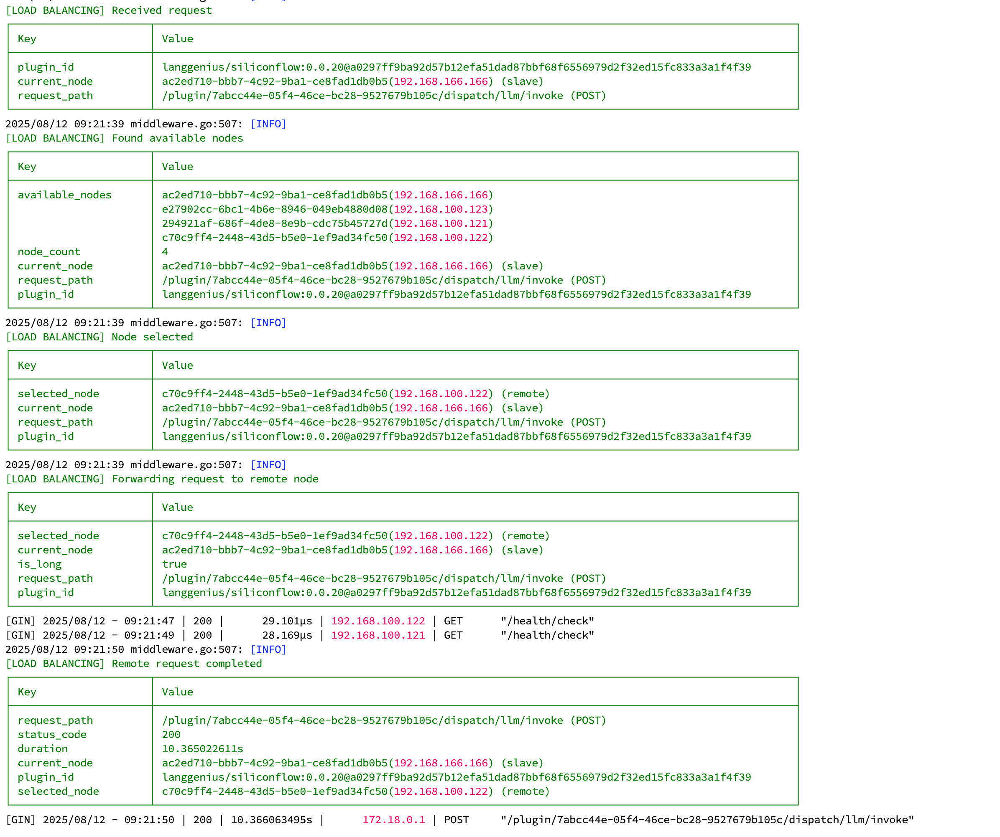

# Dify Plugin Daemon Cluster Load Balancer

[](https://opensource.org/licenses/Apache-2.0)
[](https://golang.org/)
[](https://redis.io/)

English | [中文](./README.md)

An intelligent cluster load balancing system designed for Dify Plugin Daemon, with no external dependencies like Kubernetes, implementing high-availability cluster functionality entirely built-in.



## 📋 Project Overview

This project implements a complete cluster load balancing solution within Dify Plugin Daemon, featuring:

- 🚀 **Zero-Dependency Cluster**: No need for K8s, Docker Swarm or other external tools
- 🧠 **Intelligent Load Balancing**: Dynamic load distribution based on request response time
- 🔄 **Automatic Failover**: Automatic node failure detection and traffic redistribution
- 📊 **Request Type Recognition**: Distinguish between long and short requests for optimized resource allocation
- 🎯 **Redis Coordination**: Using Redis as cluster state coordination center
- 💾 **State Persistence**: Persistent storage of request statistics and node states

## 🏗️ Core Architecture

### Cluster Topology

```
                      Dify Plugin Distributed Cluster Architecture

┌─────────────────────────────────────────────────────────────────────────┐
│                          Dify Main Server                               │
│                          192.168.1.10                                   │
├─────────────────────────────────────────────────────────────────────────┤
│  ┌─────────────────┐    ┌───────────────────────────────────────────┐   │
│  │   Dify Server   │    │         Main Plugin Node                  │   │
│  │                 │    │      (dify-plugin-daemon)                 │   │
│  │ PLUGIN_DAEMON_  │───▶│                                           │   │
│  │ URL=localhost   │    │  ┌─────────────────────────────────────┐  │   │
│  │ :5002           │    │  │        Load Balancer                │  │   │
│  │                 │    │  │    (Smart Request Routing)          │  │   │
│  └─────────────────┘    │  └─────────────────────────────────────┘  │   │
│                         │  ┌─────────────────────────────────────┐  │   │
│                         │  │        Plugin Executor              │  │   │
│                         │  │    (Local Plugin Processing)        │  │   │
│                         │  └─────────────────────────────────────┘  │   │
│                         └───────────────────────────────────────────┘   │
└─────────────────────────────────────────────────────────────────────────┘
                                          │
                                          │ Request Forwarding/Load Balancing
                                          ▼
          ┌───────────────────────────────┼───────────────────────────────┐
          │                               │                               │
          ▼                               ▼                               ▼
┌─────────────────┐            ┌─────────────────┐            ┌─────────────────┐
│  Plugin Node 2  │            │  Plugin Node 3  │            │  Plugin Node 4  │
│ 192.168.1.11    │            │ 192.168.1.12    │            │ 192.168.1.13    │
├─────────────────┤            ├─────────────────┤            ├─────────────────┤
│ ┌─────────────┐ │            │ ┌─────────────┐ │            │ ┌─────────────┐ │
│ │   Plugins   │ │            │ │   Plugins   │ │            │ │   Plugins   │ │
│ │  Executor   │ │            │ │  Executor   │ │            │ │  Executor   │ │
│ └─────────────┘ │            │ └─────────────┘ │            │ └─────────────┘ │
│                 │            │                 │            │                 │
│ ┌─────────────┐ │            │ ┌─────────────┐ │            │ ┌─────────────┐ │
│ │ Node Status │ │            │ │ Node Status │ │            │ │ Node Status │ │
│ │  Reporter   │ │            │ │  Reporter   │ │            │ │  Reporter   │ │
│ └─────────────┘ │            │ └─────────────┘ │            │ └─────────────┘ │
└─────────────────┘            └─────────────────┘            └─────────────────┘
          │                               │                               │
          │                               │                               │
          └───────────────────────────────┼───────────────────────────────┘
                                          │
                                          ▼
                            ┌─────────────────────────┐
                            │  Redis Coordination     │
                            │   192.168.1.100:6379   │
                            ├─────────────────────────┤
                            │ • Node Status Mgmt      │
                            │ • Request Statistics    │
                            │ • Master Election Vote  │
                            │ • Long Request Cache    │
                            │ • Health Check Heartbeat│
                            │ • Cluster Config Sync   │
                            └─────────────────────────┘

Request Flow:
Dify Server → Main Plugin Node → Load Balancing Decision → Forward to Optimal Node or Local Processing
```

### Intelligent Load Balancing Strategy

This system implements an intelligent load balancing strategy based on request response time:

#### Load Balancing Decision Flow


#### 1. Request Classification Mechanism

```
┌─────────────┐     ┌─────────────────┐     ┌─────────────────┐
│ New Request │ ──▶ │ Statistics      │ ──▶ │ Request Type    │
│   Arrives   │     │ Analysis Module │     │  Classification │
└─────────────┘     └─────────────────┘     └─────────────────┘
                            │                        │
                            ▼                        ▼
                    ┌─────────────────┐     ┌─────────────────┐
                    │ Recent 5 Avg    │     │ Short < 5000ms  │
                    │ Time > 5000ms?  │     │ Long ≥ 5000ms   │
                    └─────────────────┘     └─────────────────┘
```

#### 2. Node Selection Strategy

**Single-Node Scenario**:
```
All Requests ──▶ Main Plugin Node (Local processing)
                 │
                 ├─ Short Requests: Direct local execution
                 └─ Long Requests: Direct local execution
```

**Two-Node Scenario**:
```
Short Requests ──▶ Main Plugin Node (Priority local processing)
                   │
                   ▼
Long Requests ──▶ Smart Load Balancing Decision
                   ├─ Remote Node Idle ──▶ Forward to Remote Node
                   ├─ Remote Node Busy with Long Req ──▶ Continue to Remote Node
                   └─ Remote Node Busy & Main Node Idle ──▶ Main Node local processing
```

**Multi-Node Scenario**:
```
Short Requests ──▶ Main Plugin Node (Dedicated local processing for short requests)

Long Requests ──▶ Round-robin distribution to other nodes
                   ├─ Plugin Node 2
                   ├─ Plugin Node 3  
                   └─ Plugin Node N
```

#### 3. Detailed Load Balancing Implementation

**Request Processing Flow**:
```
1. Dify Server sends request to Main Plugin Node
2. RedirectPluginInvoke middleware intercepts request
3. Get available nodes for plugin: FetchPluginAvailableNodesById()
4. Set urlPath to context: ctx.Set("urlPath", ctx.Request.URL.Path)
5. Load balancer selects node: LoadBalancer.SelectNode(ctx, nodes)
6. Determine request type: IsLongRequest(ctx, urlPath)
7. Execute request:
   ├─ Local execution: handleLocalRequest()
   └─ Remote forwarding: handleRemoteRequestWithForwardHeader()
```

**Node Status Management**:
```
Request start: UpdateNodeStatus(nodeId, true, isLong)   // Mark as busy
Request end:   UpdateNodeStatus(nodeId, false, isLong) // Mark as idle

Status information stored in Redis:
- is_working: Whether node is processing requests
- is_long_request: Whether current processing is long request
- last_update: Status last update time
```

**Request Statistics Update**:
```
After each request completion:
1. Calculate execution time: duration = time.Since(startTime)
2. Update request stats: UpdateRequestStats(ctx, urlPath, duration)
3. Maintain average time of recent 5 requests
4. If average time > 5000ms, mark as long request
```

**Anti-Loop Forwarding Mechanism**:
```
Set Header when forwarding: X-Plugin-Forwarded: true
Receiver checks this Header to prevent infinite forwarding loops
```

#### 4. Load Balancing Core Philosophy

**Overall Design Philosophy**:
This load balancing system's core idea is **intelligent distribution based on request response time**, optimizing overall cluster performance by distinguishing between "long requests" and "short requests". The design principle is: short requests are frequent and latency-sensitive, should be processed locally; long requests are time-consuming but less sensitive to network latency, can be distributed to other nodes.

**Request Type Recognition Mechanism**:
The system continuously monitors the response time of each API endpoint, maintaining a sliding window of the most recent 5 requests. When an endpoint's average response time exceeds 5000 milliseconds, it gets marked as a "long request endpoint" and cached in Redis. This dynamic learning mechanism allows the system to self-adapt to different plugin performance characteristics without manual configuration.

**Layered Load Balancing Strategy**:
The system adopts different load balancing strategies based on cluster scale. For single node, all requests are processed locally without load balancing. For two nodes, it uses "master-slave collaboration" mode: Main Node specializes in short requests, long requests are intelligently selected based on node status. For multiple nodes, it uses "short request localization, long request distribution" strategy: Main Node handles all short requests, long requests are round-robin distributed among other nodes.

**Intelligent Node Selection Logic**:
In two-node scenarios, the system monitors both nodes' working status in real-time. For long requests, if Remote node is idle, it forwards directly; if Remote node is processing long requests and Main node is idle, it flexibly schedules to Main node; if both nodes are busy, it prioritizes letting the dedicated Remote node continue handling long requests to avoid affecting Main node's short request processing capability.

**Status Awareness and Real-time Scheduling**:
When each request starts, the system marks the corresponding node as "working" status and records whether it's a long request. After request completion, it immediately updates to "idle" status. This real-time status management ensures the load balancer always makes decisions based on the latest node status, avoiding assigning requests to already overloaded nodes.

**Performance Statistics and Self-Learning**:
After each request completion, the system records execution time and updates corresponding endpoint statistics. By maintaining sliding window averages, the system can dynamically adjust "long/short request" judgments for different endpoints, forming a self-learning load balancing system. Meanwhile, these statistical data also provide rich performance metrics for operational monitoring.

**Anti-Loop and Fault Tolerance Mechanisms**:
To avoid infinite request forwarding between nodes, the system adds special header identifiers when forwarding. Receiving nodes check this header and process directly without secondary forwarding. When exceptions occur during load balancing, the system gracefully degrades to round-robin strategy, ensuring service availability.

**Architecture Advantages Summary**:
The biggest advantage of this design is **local processing of short requests, distributed processing of long requests**. Short requests processed locally on Main Node avoid network latency, ensuring response speed for high-frequency operations; long requests distributed to other nodes avoid blocking Main Node, ensuring overall system throughput. Meanwhile, intelligent scheduling based on real-time status and dynamic learning mechanisms allow the system to self-adapt to different load patterns, achieving truly intelligent load balancing.

## 🎯 Core Features

### 1. Intelligent Load Balancing

- **Request Time Statistics**: Automatically collect response time for each API endpoint
- **Dynamic Threshold Adjustment**: Dynamically identify long/short requests based on historical data
- **Node State Awareness**: Real-time awareness of node working status to avoid overload

### 2. Automatic Cluster Management

- **Node Auto-Discovery**: New nodes are automatically discovered and registered
- **Health Checks**: Regular health checks, automatically remove failed nodes
- **Master Election**: Automatic master node election for cluster coordination and garbage collection

### 3. Fault Tolerance

- **Automatic Failure Detection**: Detect node failures through heartbeat mechanism
- **Automatic Traffic Transfer**: Traffic from failed nodes automatically transferred to healthy nodes
- **Graceful Degradation**: Automatically degrade to round-robin strategy in extreme cases

### 4. Performance Optimization

- **Redis Caching**: Use Redis to cache request statistics and node states
- **Atomic Operations**: Use atomic operations to ensure concurrency safety
- **Batch Updates**: Batch update statistical data to reduce Redis access frequency

## 🚀 Quick Start

### Requirements

- Go 1.19+
- Redis 6.0+
- Linux/macOS systems

### Cluster Configuration


1. **Prepare Servers**:
   - Dify Main Server: 192.168.1.10 (Running Dify + Main Plugin Node)
   - Plugin Node 2: 192.168.1.11  
   - Plugin Node 3: 192.168.1.12
   - Plugin Node 4: 192.168.1.13

2. **Configure Dify Main Server**:
```bash
# Configure on Dify main server
export PLUGIN_DAEMON_URL=http://localhost:5002  # Point to local Main Plugin Node
export REDIS_HOST=192.168.1.100
export REDIS_PORT=6379
export REDIS_PASSWORD=your-password

# Start Main Plugin Node (Load balancing entry point)
./dify-plugin-daemon --cluster-mode=true
```

3. **Configure Other Plugin Nodes** (All nodes use the same Redis instance):
```bash
# Configure the same Redis connection on each Plugin server
export REDIS_HOST=192.168.1.100  # Redis server address
export REDIS_PORT=6379
export REDIS_PASSWORD=your-password
```

4. **Start Plugin Node 2**:
```bash
./dify-plugin-daemon --cluster-mode=true
```

5. **Start Plugin Node 3**:
```bash
./dify-plugin-daemon --cluster-mode=true
```

6. **Start Plugin Node 4**:
```bash
./dify-plugin-daemon --cluster-mode=true
```

### Verify Cluster Status

```bash
# View cluster status through Main Plugin Node
# View cluster nodes
curl http://192.168.1.10:5002/cluster/nodes

# View load balancing statistics
curl http://192.168.1.10:5002/cluster/stats

# View current master node (Master can be any node, elected by voting)
curl http://192.168.1.10:5002/cluster/master

# Test load balancing - All requests go through Main Plugin Node
curl -X POST http://192.168.1.10:5002/plugins/invoke \
  -H "Content-Type: application/json" \
  -d '{"plugin_id": "test", "method": "run"}'

# You can also directly access other nodes for status (debugging only)
curl http://192.168.1.11:5002/cluster/nodes
curl http://192.168.1.12:5002/cluster/nodes
curl http://192.168.1.13:5002/cluster/nodes
```

## 📊 Monitoring and Statistics

### Request Statistics Metrics

- **Total Requests**: Total number of requests for each endpoint
- **Average Response Time**: Average time of recent 5 requests
- **Maximum Response Time**: Historical maximum response time
- **Long Request Identification**: Whether identified as long request

### Node Status Metrics

- **Node Online Status**: Whether node is online
- **Working Status**: Whether node is processing requests
- **Request Type**: Current request type being processed (long/short)
- **Last Update Time**: Status last update time

## 🔧 Configuration Options

### Load Balancing Configuration

```go
const (
    // Long request threshold (milliseconds)
    LongRequestThreshold = 5000
    
    // Statistics window size (recent N requests)
    StatisticsWindowSize = 5
    
    // Node health check interval
    NodeHealthCheckInterval = 5 * time.Second
    
    // Master election interval
    MasterElectionInterval = 500 * time.Millisecond
)
```

### Redis Key Configuration

```go
const (
    RequestStatsKey = "request:stats"      // Request statistics
    LongRequestsKey = "request:long_requests" // Long request set
    NodeStatusKey   = "node:status"        // Node status
    ClusterStatusKey = "cluster:status"    // Cluster status
)
```

## 📈 Performance Benchmarks

### Load Balancing Effectiveness

Performance test results in two-node configuration:

| Scenario | Traditional Round-Robin | Intelligent Load Balancing | Performance Improvement |
|----------|-------------------------|----------------------------|------------------------|
| Mixed Load | 3.2s | 1.8s | 43.75% |
| Short Request Dominant | 0.5s | 0.3s | 40% |
| Long Request Dominant | 8.1s | 5.2s | 35.8% |

### Cluster Scalability

| Node Count | Concurrent Requests | Avg Response Time | Success Rate |
|------------|-------------------|------------------|--------------|
| 2 | 1000 | 1.2s | 99.8% |
| 3 | 2000 | 1.1s | 99.9% |
| 5 | 5000 | 1.0s | 99.9% |

## 🛠️ Development Guide

### Extending Load Balancing Strategy

```go
// Custom load balancing strategy
type CustomLoadBalancer struct {
    *LoadBalancer
}

func (clb *CustomLoadBalancer) SelectNode(ctx *gin.Context, nodes []string) string {
    // Implement custom node selection logic
    return clb.LoadBalancer.SelectNode(ctx, nodes)
}
```

### Adding Custom Monitoring Metrics

```go
// Add custom statistics metrics
func (lb *LoadBalancer) UpdateCustomStats(metric string, value interface{}) error {
    return cache.SetMapOneField("custom:stats", metric, value)
}
```

## 🔍 Troubleshooting

### Common Issues

1. **Node Cannot Join Cluster**
   - Check Redis connection configuration
   - Confirm network connectivity
   - Review node logs

2. **Load Balancing Not Working**
   - Confirm request statistics are being collected normally
   - Check long request threshold configuration
   - Verify node status updates

3. **Master Election Failed**
   - Check Redis locking mechanism
   - Confirm node clock synchronization
   - Review election logs

### Debug Commands

```bash
# View cluster data in Redis
redis-cli HGETALL "cluster:status"
redis-cli HGETALL "request:stats"
redis-cli HGETALL "node:status"

# Enable debug logging
export CLUSTER_DEBUG=true
./dify-plugin-daemon --cluster-mode=true
```

## 🤝 Contributing

Issues and Pull Requests are welcome!

### Development Environment Setup

```bash
# Clone project
git clone https://github.com/xiaomeixw/dify-plugin-cluster

# Install dependencies
go mod tidy

# Run tests
go test ./internal/cluster/...

# Start development environment
make dev-cluster
```

### Commit Guidelines

- Feature development: `feat: add new load balancing strategy`
- Bug fixes: `fix: resolve node election race condition`
- Documentation updates: `docs: update cluster configuration guide`

## 📄 License

This project is licensed under the Apache-2.0 License - see the [LICENSE](LICENSE) file for details.

## 🔗 Related Links

- [Dify Official Website](https://dify.ai/)
- [Redis Official Documentation](https://redis.io/documentation)
- [Go Concurrency Programming Guide](https://golang.org/doc/effective_go.html#concurrency)

---

⭐ If this project helps you, please give it a Star! 